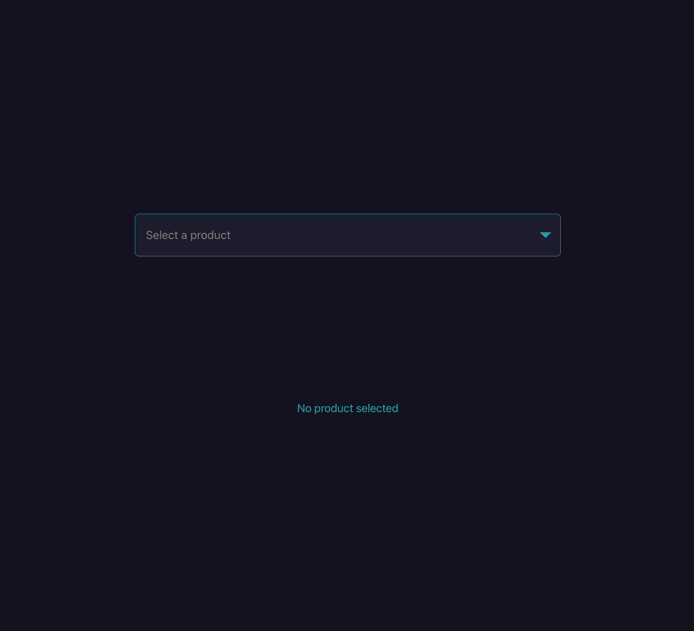

# Baqla Diligent Robotics Assessment


## [Deployed Link](https://baqla-diligent-robotics-assessment.vercel.app/)

## Setup and Run the baqla-diligent-robotics-assessment App

Follow the steps below to set up the app on your local machine:

1. **Clone the Repository**  
   Start by cloning the repo to your local machine:
   ```
   git clone git@github.com:missatrox44/baqla-diligent-robotics-assessment.git
   ```

2. **Navigate to the Directory**  
   Once cloned, move to the project's root directory:
   ```
   cd baqla-diligent-robotics-assessment
   ```

3. **Install Dependencies**  
   Install all necessary npm packages:
   ```
   npm install
   ```

4. **Start the Development Server**  
   Run the development server using:
   ```
   npm run dev
   ```

5. **Open the App in Your Browser**  
   After starting the development server, you should see a link in the terminal. Click on it, or manually navigate to `http://127.0.0.1:5173/` in your web browser. The React app should now be running on your localhost.
   
   <br/>

## Using the App
The app provides a straightforward interface to view product details. Here's how to use it:

### 1. **Select a Product**
   - Upon opening the app, you'll find a dropdown menu at the center of the page.
   - Click on the dropdown to see a list of available products.
   - Navigate through the list and select the product of interest.

### 2. **View Product Details**
   - Immediately after selecting a product, a 'Product Details' card will appear on the screen.
   - This card presents essential information about the chosen product, such as its name, description, price, and other relevant details.

**Tip:** The interface is designed to be intuitive. If you wish to view details of another product, simply return to the dropdown menu and make another selection.

